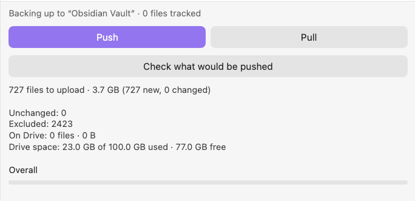

# GeodeDrive

[English](../README.md) · **Русский** · [简体中文](README.zh-CN.md) · [Español](README.es.md)

[](https://github.com/lif0/geode-drive-backup/actions/workflows/ci.yml)
[](../LICENSE)
[](https://obsidian.md)
[](#)
[](#шифрование)

Плагин сохраняет резервную копию хранилища Obsidian на **ваш собственный** Google Drive, а выбранные файлы и папки может ещё и шифровать.

Работает и на компьютере, и на телефоне: без Node API, без `fetch`, без зависимостей в рантайме.



> [!NOTE]
> **Этот перевод сделан с помощью LLM и не проверен носителем языка.** Источник истины —
> [английский README](../README.md): если тексты расходятся, верить нужно ему. Нашли кривую
> формулировку, ошибку или неточный термин — поправьте `docs/README.ru.md` и пришлите PR либо
> [откройте issue](https://github.com/lif0/geode-drive-backup/issues). Даже одна исправленная строка
> полезна. Новые языки тоже приветствуются: скопируйте английский файл в `docs/README.<код>.md`,
> сохраните тот же порядок разделов и добавьте его в строку языков выше.

> Названия команд, настроек и кнопок в этом руководстве оставлены на английском — именно так они выглядят в интерфейсе Obsidian.

---

## Установка

### Из релиза

1. Скачайте `main.js` и `manifest.json` из
   [последнего релиза](https://github.com/lif0/geode-drive-backup/releases).
2. Положите их в `<ваше хранилище>/.obsidian/plugins/geode-drive-backup/`.
3. Перезапустите Obsidian и включите **GeodeDrive** в _Settings → Community plugins_.

### Из исходников

```bash
git clone https://github.com/lif0/geode-drive-backup.git
cd geode-drive-backup
npm install
npm run build          # typecheck + lint + тесты + сборка
```

Скопируйте `main.js` и `manifest.json` в папку плагина внутри хранилища. Или сделайте туда симлинк
на репозиторий и запустите `npm run dev` — тогда сборка будет обновляться сама.

---

## Настройка: ваш собственный OAuth-клиент Google

GeodeDrive никогда не пропускает ваши заметки через чужие серверы, поэтому учётные данные Google вы заводите сами.
Это разовая настройка минут на десять.

1. Откройте [Google Cloud Console](https://console.cloud.google.com/) и создайте проект.
2. **APIs & Services → Library** → включите **Google Drive API**.
3. **APIs & Services → OAuth consent screen**. В нынешней консоли это открывает **Google Auth
   Platform**. Нажмите **Get started** и заполните название приложения, свой адрес как support
   email, **Audience: External** и свой адрес ещё раз в контактных данных.
4. Откройте вкладку **Audience** и нажмите **Publish app**, чтобы статус сменился на
   _In production_. Если хотите пропустить этот шаг — сначала прочитайте блок ниже: для инструмента резервного копирования он обязателен.
5. Откройте вкладку **Clients** → **Create client** → тип приложения
   **TVs and Limited Input devices** → задайте имя → **Create**.
6. Скопируйте **Client ID** и **Client secret**.
7. В Obsidian: _Settings → Geode_ → вставьте оба значения и нажмите **Connect**.
8. Появится окно с коротким кодом и ссылкой. Откройте ссылку на любом устройстве, где удобно
   печатать, введите код и подтвердите доступ — окно закроется само.

> [!IMPORTANT]
> **Не оставляйте приложение в статусе _Testing_.** Любому External-приложению в этом статусе
> Google выдаёт refresh-токен, который живёт всего **7 дней**. После этого GeodeDrive будет раз в
> неделю падать с ошибкой «Google revoked this connection» — и так до бесконечности. Кнопка
> **Publish app** решает это раз и навсегда.
>
> Публикация бесплатна. Вы остаётесь единственным пользователем, а `drive.file` — **non-sensitive**
> scope: ни подача на ревью, ни аудит безопасности не нужны. Экран согласия может предупредить, что
> приложение не верифицировано, — для приложения, которым пользуетесь только вы, это нормально:
> откройте **Advanced** и продолжите.
>
> Если вы сознательно оставляете статус _Testing_, сначала добавьте свой аккаунт в
> **Audience → Test users**. Этот раздел существует только в статусе _Testing_ — после публикации
> вы его уже не найдёте.

Почему тип клиента так странно называется, почему клиент создаёте вы сами и почему публиковать
приложение безопасно — написано в [docs/auth-design.md](auth-design.md) (на английском).

GeodeDrive запрашивает ровно одну область доступа — `https://www.googleapis.com/auth/drive.file`.
Она даёт доступ только к файлам, которые создал сам плагин; ничего другого на вашем Drive он
прочитать не может.

Даже опубликованный токен перестанет работать, если отозвать доступ на
[myaccount.google.com/permissions](https://myaccount.google.com/permissions) или если за полгода не
случится ни одной отправки и ни одной загрузки.

> **Вход не работает, Google отвергает device flow?**
> Значит, у клиента неподходящий тип. Либо пересоздайте его как _TVs and Limited Input devices_,
> либо переключите **Sign-in method** на _Redirect with PKCE_ в настройках. Этот способ открывает
> обычную страницу согласия Google, затем перенаправляет на `127.0.0.1` — эта страница, разумеется,
> не загрузится — и просит вставить содержимое адресной строки обратно в Obsidian. Некрасиво, зато
> не нужен локальный веб-сервер, а значит, работает и на телефоне.

На диск записывается только refresh-токен. Access-токены живут в памяти — плагин запрашивает их
заново, когда они нужны.

---

## Использование

В палитре команд (`Ctrl/Cmd+P`) семь команд. Кроме них есть иконка на ленте и элемент в статусной
строке — оба открывают панель, — а вверху вкладки настроек есть кнопки **Push now** / **Pull now**.

| Команда                      | Что делает                                                             |
| ---------------------------- | ---------------------------------------------------------------------- |
| **Push changes to Drive**    | Загружает новые и изменённые файлы. Остальное пропускает.              |
| **Pull vault from Drive**    | Скачивает весь бэкап. Никогда не перезаписывает и не удаляет.          |
| **Unlock encryption**        | Проверяет парольную фразу и кэширует ключ на сессию.                   |
| **Connect Google account**   | Запускает вход в аккаунт.                                              |
| **Show backup status**       | Подключение, папка, число отслеживаемых файлов, состояние шифрования.  |
| **Show progress panel**      | Открывает панель. То же делают иконка на ленте и статусная строка.     |
| **Cancel current operation** | Останавливается после текущего файла. Ничего не остаётся недописанным. |

### Панель

Иконка на ленте открывает панель справа — ту самую, [что на картинке в начале](#geodedrive). Отсюда
можно запустить бэкап и здесь же следить за его ходом. Сама по себе панель ничего не отправляет,
пока вы не нажмёте кнопку. А перед запуском полезно посмотреть, что именно будет отправлено.

**Check** — это пробный прогон: он подсчитывает, что было бы отправлено, но ничего не отправляет, и
заодно узнаёт у Drive, сколько там осталось места. Парольная фраза для этого не нужна. Такой прогон
не бесплатен: чтобы понять, что изменилось, приходится обойти хранилище так же, как это делает push.
Поэтому он запускается по кнопке, а не автоматически при каждом открытии панели.

Последняя строка — про место на Drive. Если места не осталось, push упадёт с ошибкой
`storageQuotaExceeded`, и повторять попытки бессмысленно. Панель предупредит об этом заранее, ещё до
отправки.

### Точки в проводнике файлов

Рядом с каждым файлом и каждой папкой в боковой панели Obsidian появляется точка — она показывает,
в каком состоянии файл.

| Точка         | Значение                                            |
| ------------- | --------------------------------------------------- |
| **зелёная**   | лежит на Drive и с тех пор здесь не менялся         |
| **оранжевая** | ни разу не отправлялся или изменился после отправки |
| **серая**     | исключён, и строка приглушена                       |

Папка окрашивается в самый «тревожный» цвет из своего содержимого. Зелёная папка означает, что все
файлы под ней уже на Drive; одна неотправленная заметка красит всю ветку в оранжевый.

Цвет вычисляется по размеру и дате изменения файла, а не по хешу — тем же коротким путём, которым
push решает, что файл можно не перечитывать. Если хеш файла помечен как ненадёжный (об этом ниже, в
пункте про метки времени), точка будет оранжевой. Это честно: следующая отправка такой файл
действительно перечитает.

> У Obsidian нет API для оформления дерева файлов, поэтому точки рисуются прямо поверх разметки
> проводника — по атрибуту `data-path`, который есть у каждой строки. Ничего личного плагин при этом
> не читает, но это опора на внутреннюю разметку, а не на официальный контракт. Если точки вдруг
> пропадут, подозревать нужно в первую очередь именно её. Отключаются они настройкой **Mark files in
> the file explorer**.

### Как следить за запуском

Пока идёт отправка или загрузка, следить за ней можно в трёх местах. Случайно закрыть их не
получится.

- **Статусная строка** справа внизу — там будет `Geode 142/486 · 38%`. Клик по ней открывает панель.
- **Панель.** В ней появляются две полосы: одна на весь запуск, вторая на текущий файл. Рядом видно
  байты, имя файла и кнопку Cancel. Откройте панель посреди отправки — она покажет отправку, а не
  пустой экран.
- **Итоговое уведомление** со сводкой.

Общая полоса считает байты, а не файлы, поэтому показывает честный прогресс с первой секунды: плагин
заранее знает, какие файлы уйдут и сколько они весят. Сто заметок и одно видео — это не сто один
одинаковый шаг.

Полоса текущего файла двигается только на больших файлах — тех, что уходят кусками. Это файлы больше
5 МБ, они идут по resumable-маршруту кусками по 1 МБ. Всё, что меньше, уходит одним запросом, а
`requestUrl` из Obsidian ничего не сообщает, пока запрос не завершится, — поэтому для мелких файлов
полоса заполняется сразу целиком. Так оно на самом деле и происходит, так и показывается.

Благодаря кускам **Cancel срабатывает и внутри большого файла**, а не только между файлами. Видео на
400 МБ остановится через мегабайт, а не в самом конце.

> На телефоне Obsidian не даёт плагинам статусную строку. Там за прогрессом можно следить в панели и
> по иконке на ленте.

### Типичный первый запуск

```
Connect Google account   →   Push changes to Drive
```

Первая отправка создаёт папку на Drive (по умолчанию она называется `Geode`) и загружает туда всё.
Дальше уходит только то, что изменилось.

### Восстановление на новом устройстве

```
Установить Geode  →  вставить тот же client ID и secret  →  Connect  →  Pull vault from Drive
```

Pull скачивает все файлы и восстанавливает дерево папок из закодированных имён. Если по тому же пути
в хранилище уже лежит файл, а плагин не может доказать, что файлы одинаковые, копия с Drive
запишется рядом под именем `note (from drive).md`. При повторном совпадении получится
`(from drive 2)`, `(from drive 3)` и так далее. **Pull никогда ничего не удаляет и не
перезаписывает.**

Совпадение путей проверяется без учёта регистра — даже на Linux. Для Drive `Note.md` и `note.md` —
разные файлы, а для APFS, NTFS и exFAT на SD-карте Android — один и тот же, поэтому запись второго
молча уничтожила бы первый. На файловой системе, где регистр всё-таки важен, вы получите одну
лишнюю копию `(from drive)` — ошибка в обратную сторону стоила бы вам потерянной заметки.

### Как остановить долгий запуск

Push и pull можно прервать в любой момент: нажмите **Cancel** в уведомлении о прогрессе или
выполните команду **Cancel current operation**. Плагин дозагрузит текущий файл и остановится, так
что на Drive не останется недописанных файлов, а в хранилище — обрезанных.

Всё, что успело уйти, остаётся на месте. Индекс сохраняется каждые 25 файлов, а не только в конце,
поэтому прерванный запуск просто продолжится с того места, где остановился, — неважно, отменили вы
его сами или у телефона села батарея.

### Как читать итоговую сводку

Каждый запуск заканчивается уведомлением.

```
Push finished: 12 uploaded, 3 updated, 486 unchanged.

2 skipped — changed on another device:
  Journal/2026-07-30.md
  Projects/roadmap.md
```

**Конфликт** означает, что копию на Drive изменили после того, как это устройство её туда записало.
Плагин не угадывает, чья версия правильная: он пропускает файл и сообщает об этом. Дальше можно
сделать pull и получить обе копии рядом — или разобраться вручную.

Иногда в сводке появляется **предупреждение** — например, на один путь нашлось два файла на Drive
или в папке лежат файлы, которые плагин туда не клал. В счётчики такое не попадает, но означает, что
бэкап выглядит не совсем так, как вы думаете.

---

## Что именно попадает в бэкап

В хранилище редко лежат одни только заметки. Обычно туда же попадают результаты сборки, бинарники,
целые папки программ и тяжёлые видео. Бэкапу, который заводят ради текстов, всё это ни к чему.

Есть два переключателя. Оба по умолчанию выключены, оба понимают синтаксис `.gitignore`.

| Настройка                            | Что делает                                             |
| ------------------------------------ | ------------------------------------------------------ |
| **Respect the vault's `.gitignore`** | Читает `.gitignore` из корня хранилища и применяет его |
| **Never upload these paths**         | Ваши собственные правила, применяются после файла      |

Строки из настроек применяются вторыми, поэтому `!` в них может вернуть обратно то, что исключил
`.gitignore` репозитория. Хранилище — это сначала репозиторий и только потом бэкап, а этим двум
ролям не всегда нужны одни и те же файлы.

```gitignore
bin/                    # папка на любой глубине, в том числе Projects/app/bin
[Oo]bj/                 # классы символов работают
/Drafts                 # слеш в начале привязывает к корню хранилища
*.mp4                   # любая глубина, любая папка
!Notes/demo.mp4         # …кроме этого файла
**/.idea/**/*.iml       # ** проходит сквозь папки
```

Поддерживаются комментарии `#`, отрицание `!` (приоритет у последнего совпавшего правила), привязка
через `/`, слеш в конце для папок, `*`, `?`, `**` и классы символов `[abc]` / `[!a-z]`. Вложенные
`.gitignore` внутри хранилища не читаются — только корневой.

Три вещи, которые стоит знать до того, как это включать.

- **Правило без слеша срабатывает на любой глубине.** `test/` исключит и `test/` в корне, и
  `Notes/test/`. Так устроен git — и именно так обычно случайно теряют папку с настоящими заметками.
  Нажмите **Preview exclusions** в настройках: плагин применит правила к вашему хранилищу и покажет,
  что осталось бы за бортом. Ничего никуда при этом не загружается.
- **Исключить — не значит удалить.** Если файл перестал попадать в бэкап, его копия на Drive никуда
  не денется: плагин не будет её ни обновлять, ни удалять — даже при включённом переносе удалений.
  Бэкап, который забывает файл в тот же день, когда вы его исключили, бэкапом не назовёшь.
- **Исключения действуют на push, но не на pull.** Они решают, что уходит с этого устройства. Всё,
  что уже лежит в бэкапе, можно вернуть обратно — ради этого бэкап и нужен.

Исключённый файл вообще не открывается. Исключённые гигабайты больше не отнимают время при каждой
отправке: их не нужно читать и хешировать только ради того, чтобы потом пропустить. В сводке будет
указано, сколько файлов осталось за бортом.

Кнопка **Show what is excluded** в панели показывает весь список в виде дерева. Папки сначала
свёрнуты, у каждой подписано, сколько файлов внутри и сколько они весят. Несколько тысяч исключённых
путей превращаются в десяток строк, которые реально прочитать, — и папку `Journal`, случайно
попавшую в список рядом с артефактами сборки, здесь трудно не заметить. Наверху — самые тяжёлые
папки: обычно почти весь выигрыш от исключений приходится на две-три из них.

Файлы и папки, начинающиеся с точки, Obsidian плагинам вообще не показывает. Поэтому `.obsidian/`,
`.git/`, `.idea/` и им подобные в бэкап никогда не попадали — и правила на их счёт ничего не меняют.

---

## Шифрование

По умолчанию выключено. Если включить, файлы, чей путь совпал с одним из ваших префиксов, шифруются
ещё **до** того, как покинут устройство.

- **Шифр:** AES-256-GCM, свежий случайный 12-байтовый nonce для каждого файла при каждой отправке.
- **Ключ:** PBKDF2-SHA256, 600 000 итераций, ключ 32 байта, случайная 16-байтовая соль на хранилище.
- **Контейнер:** `MAGIC "OBEV" | VERSION 0x01 | SALT (16) | NONCE (12) | ciphertext+tag`.

Ключ вычисляется один раз при разблокировке и держится в памяти: если выводить его заново для
каждого файла, Obsidian зависнет на любом реальном хранилище. При выгрузке плагина ключ
стирается. Сама парольная фраза никуда не записывается.

### Что именно шифровать

В настройках вы перечисляете префиксы путей, по одному на строку. Правила намеренно простые:
слишком умные правила рано или поздно приводят к тому, что файл, который вы считали зашифрованным,
уходит в открытом виде.

| Префикс    | Совпадает с                                 | Не совпадает с  |
| ---------- | ------------------------------------------- | --------------- |
| `Journal`  | `Journal`, `Journal/2026.md`, `Journal/a/b` | `Journalism.md` |
| `Journal/` | то же самое                                 | `Journalism.md` |
| `Journal*` | `Journal/2026.md`, `Journalism.md`          | `Diary.md`      |

Регистр важен. `*` работает только в конце строки. Строки, начинающиеся с `#`, пропускаются.

### Файл проверки парольной фразы

Первая зашифрованная отправка кладёт в папку на Drive маленький файл `__keycheck` — в нём соль
хранилища и известная плагину строка-маркер. Новое устройство скачивает его первым и проверяет вашу
парольную фразу **до того, как трогать реальные данные**. Если фраза неверная, всё остановится сразу
и на диске ничего не изменится.

### Ограничения, о которых нужно знать

- **Имена файлов не шифруются.** Пути кодируются в base64url, чтобы их принял Drive, — это
  кодирование, а не шифрование. Любой, у кого есть доступ к папке, увидит все пути вашего хранилища.
- **Размеры файлов не скрываются.** Контейнер весит столько же, сколько исходный файл, плюс 49 байт.
- **Восстановить ничего нельзя.** Забудете парольную фразу — зашифрованные файлы потеряны. И для
  вас, и для всех остальных.
- Зашифрован файл или нет, плагин при скачивании определяет по заголовку `OBEV`. Ни расширение, ни
  флаг `enc` в метаданных Drive для этого не годятся: и то и другое со временем расходится с
  реальностью, а заголовок — нет.

---

## Аварийное восстановление без Obsidian

`tools/decrypt.mjs` полностью автономен: он ничего не берёт из `src/`, ему не нужны ни
`npm install`, ни сборка. Положите этот единственный файл рядом со скачанной папкой Drive — и
заметки можно вернуть, имея только Node и парольную фразу.

```bash
# Один файл в stdout
node tools/decrypt.mjs 5rWL6K-VLm1k

# Один файл на диск
node tools/decrypt.mjs 5rWL6K-VLm1k -o note.md

# Восстановить всё хранилище из скачанной папки Drive
# декодирует имена, расшифровывает что зашифровано, остальное копирует как есть
GEODE_PASSPHRASE='…' node tools/decrypt.mjs --dir ./downloaded-Geode --out ./restored

# Проверить, что этот инструмент согласуется с плагином
node tools/decrypt.mjs --verify-vectors test/vectors.json
```

Парольную фразу скрипт берёт из `--passphrase`. Если её там нет — из переменной `GEODE_PASSPHRASE`.
Если нет и её, просто спросит.

### Эталонные векторы

В `test/vectors.json` зафиксированы четыре случая: пустой файл, короткий ASCII, UTF-8 с кириллицей
и эмодзи и 1 МиБ бинарных данных. Для каждого записаны парольная фраза, соль, nonce, исходный текст
и точный ожидаемый контейнер.

Две независимые реализации должны сойтись на всех четырёх: `src/core/container.ts` проверяет
`npm test`, а `tools/decrypt.mjs` — `npm run verify:vectors`. CI гоняет обе. Векторы можно только
добавлять: если формат меняется, надо поднять `VERSION` и дописать новые случаи, а не править
старые.

---

## Как определяются изменения

Чтобы понять, изменился ли файл, плагин сравнивает SHA-256 его **открытого текста** с локальным
индексом в `data.json`.

Это важнее, чем кажется. У зашифрованных файлов на каждой отправке новый nonce, поэтому шифротекст —
а вместе с ним и `md5Checksum` на Drive — меняется каждый раз, даже если сама заметка не менялась.
Если бы плагин ориентировался на контрольные суммы с Drive, ему пришлось бы заново выгружать всё
хранилище при каждом запуске. Хеш открытого текста — единственное, что остаётся неизменным.

Удалённый md5 нужен ровно для одного: по нему видно, что файл переписало **другое устройство**. Это
конфликт, и такой файл плагин затирать отказывается.

Хеш открытого текста никогда не покидает ваше устройство. Если бы плагин отправлял его вместе с
зашифрованным файлом, любой, у кого есть доступ к папке, мог бы проверить свою догадку о содержимом.

Что из этого следует.

- Если у файла совпали **и** дата изменения, **и** размер, плагин берёт записанный хеш и файл вообще
  не открывает. На большом хранилище, где мало что поменялось, push проходит по всем файлам, но
  почти ни один из них не читает. Решение при этом всё равно принимает только sha256: дата изменения
  не доказывает, что файл изменился, — она лишь говорит, что он мог измениться.
- Этот трюк работает, только если часы файловой системы точнее ваших правок. FAT32 — а именно в него
  обычно отформатирована SD-карта Android — округляет время до двух секунд. Правка, попавшая в тот же
  тик и не изменившая размер файла, навсегда осталась бы незамеченной. Поэтому если файл менялся
  меньше одного тика назад, его хеш помечается как ненадёжный, и в следующий раз файл перечитывается.
- Pull такими сокращениями не пользуется и хеширует всё подряд. К нему обращаются, когда что-то уже
  пошло не так, и цена ошибки здесь выше: посчитав, что локальный файл совпадает с бэкапом, плагин
  не стал бы скачивать копию рядом.
- Пути приводятся к Unicode NFC. macOS отдаёт `é` как `e` плюс отдельный знак ударения, а Windows и
  Linux — одним символом. Без нормализации одна и та же заметка уехала бы на Drive дважды под
  разными именами и вечно конфликтовала бы сама с собой.
- Потерять `data.json` не страшно. Следующая отправка увидит файлы, о которых ничего не знает,
  найдёт их на Drive и сообщит о конфликтах, а не затрёт их. Pull соберёт индекс заново.
- Запись о пути, которого больше нет ни в хранилище, **ни** на Drive, из индекса удаляется. Поэтому
  `data.json` не растёт бесконечно, а счётчик отслеживаемых файлов остаётся честным.
- `.obsidian/` в бэкап не попадает никогда: там лежит `data.json`, а в нём — ваш refresh-токен
  Google.

### Разговор с Drive

- **Троттлинг — это норма, а не ошибка.** На пачку загрузок Drive штатно отвечает 429 или временным
  5xx. Плагин повторяет такие запросы с растущей задержкой и случайной добавкой, учитывает
  `Retry-After` и делает до пяти попыток. 403 из-за лимита частоты тоже повторяется, а вот 403 с
  `storageQuotaExceeded` — тот, что про закончившееся место, — нет: ждать тут бесполезно. Отмена
  проверяется и во время ожидания, так что дожидаться конца двадцатисекундной паузы не придётся.
- **Если всё падает с одной и той же ошибкой, запуск останавливается.** После пяти подряд сетевых
  ошибок или ошибок доступа плагин завершает работу и сообщает об этом. Иначе он перебрал бы две
  тысячи файлов и две тысячи раз доложил об одной и той же проблеме. Всё, что успело уйти, останется
  записанным.
- **Файлы больше 5 МБ уходят через resumable-сессию, по 1 МБ за раз.** Google советует multipart
  только для файлов до 5 МБ, а крупные вложения — как раз те файлы, которые бэкап терять не имеет
  права. Загрузка кусками стоит одного лишнего запроса на каждый мегабайт, зато даёт прогресс внутри
  файла и Cancel, который работает не только между файлами. Большие скачивания идут так же, по
  диапазонам.
- **Сохранённый id папки плагин проверяет, а не принимает на веру.** Если папку на Drive отправили в
  корзину или вы подключили другой аккаунт Google, запрос списка всё равно пройдёт успешно и вернёт
  пустой список — со стороны это выглядит так, будто Drive потерял всё хранилище. Один запрос в
  начале запуска превращает эту ситуацию в обычный поиск папки по имени.
- **На один путь на Drive могут претендовать два файла.** Drive не требует уникальных имён, поэтому
  два устройства, создавшие одну и ту же заметку почти одновременно, дадут именно такой результат.
  Плагин берёт более новый файл — причём на всех устройствах выбирает одинаково — и сообщает об этом
  в сводке, а не прячет вторую копию.

### Как всё хранится на Drive

Плоско. Одна папка, один файл на Drive на каждый файл хранилища, никакой вложенности.

```
Geode/
  bm90ZS5tZA                    ← base64url("note.md")
  Sm91cm5hbC8yMDI2LTA4LTAxLm1k  ← base64url("Journal/2026-08-01.md")
  __keycheck
```

Путь лежит прямо в имени файла, потому что `appProperties` у Drive ограничены примерно 124 байтами
на пару ключ-значение — любой путь с не-ASCII символами туда просто не влезает. В `appProperties`
хранится только `{ v, enc }`.

У каждой загрузки эта папка указана родителем, так что записанное плагином не может оказаться
где-то ещё. А `drive.file` не даёт ему видеть остальной ваш Drive.

Папка создаётся в корне «Мой диск», и выбрать другое место плагин не предложит: с `drive.file` он не
видит ваше дерево папок, поэтому взять id родителя ему просто неоткуда. Хотите навести порядок —
**один раз перетащите папку в веб-интерфейсе Drive**. Плагин обращается к ней по file id и переезда
даже не заметит. А если `data.json` когда-нибудь потеряется, запасной поиск идёт по имени без
привязки к родителю и найдёт папку там, куда вы её положили.

---

## Справочник настроек

| Настройка                       | По умолчанию | Примечания                                                        |
| ------------------------------- | ------------ | ----------------------------------------------------------------- |
| Client ID / secret              | пусто        | Ваш собственный OAuth-клиент Google                               |
| Sign-in method                  | Device       | Переключайте на PKCE, только если Google отвергает device flow    |
| Drive folder name               | `Geode`      | Если сменить после отправки, плагин будет смотреть в другую папку |
| Respect the vault's .gitignore  | выкл.        | Читает корневой `.gitignore` и пропускает исключённое им          |
| Never upload these paths        | пусто        | Ваши правила, синтаксис `.gitignore`, применяются после него      |
| Mark files in the file explorer | вкл.         | Точка у каждого файла и папки — зелёная, оранжевая или серая      |
| Encrypt selected paths          | выкл.        | Включает список префиксов ниже                                    |
| Encrypted paths                 | пусто        | По одному префиксу на строку                                      |
| Ask for the passphrase          | Раз в сессию | Или при каждой отправке и загрузке                                |
| **Mirror deletions to Drive**   | **выкл.**    | Если включено, локальное удаление навсегда убирает копию с Drive  |

> **Про перенос удалений.** Пока настройка выключена, удалённый локально файл остаётся в бэкапе —
> обычно ради этого бэкап и заводят. Когда она включена, отправка удаляет копию с Drive навсегда,
> минуя корзину. Бэкап, который забывает всё, что вы удалили, вернуть вам это уже не сможет.
>
> На исключения это не распространяется. Даже при включённом переносе удалений добавление пути в
> `.gitignore` не удалит его копию с Drive. Исключённый файл — это файл, который плагин перестал
> трогать, а не файл, который вы попросили стереть.

---

## Разработка

```bash
npm run dev             # esbuild в режиме наблюдения
npm run typecheck       # tsc по src, test и tools
npm run lint            # eslint с проверкой типов
npm run test            # vitest по src/core
npm run verify:vectors  # автономный дешифратор против эталонных векторов
npm run format
npm run build           # всё сразу, затем production-сборка
```

### Структура

```
src/
  main.ts        жизненный цикл, команды, связывание, без бизнес-логики
  types.ts       брендированные типы, Result, AppError
  settings.ts    форма настроек, значения по умолчанию, миграция
  core/          чистая логика: container, kdf, path-codec, selector, ignore,
                 diff, backup-state, path-tree, bytes
  drive/         auth-provider, device-flow, pkce-flow, client, dto
  ops/           push, pull, estimate, folder, index-store
  ui/            settings-tab, модальные окна, progress hub, панель прогресса
test/            vitest только по src/core, без моков и заглушек Obsidian
tools/           автономный дешифратор, генератор векторов, бамп версии
```

Два правила проверяются самой сборкой, а не держатся на честном слове.

- **Ничто в `src/core/` не импортирует `obsidian`.** Весь ввод-вывод приходит снаружи, поэтому
  криптографию и логику сравнения можно тестировать в чистом Node без моков.
- **Ничто в `src/` не трогает Node API.** В `tsconfig.json` стоит `types: []`, так что `Buffer`,
  `process` и `require` просто не компилируются, а ESLint дополнительно запрещает их по имени вместе
  с `fetch`. Весь HTTP идёт через `requestUrl` из Obsidian — только он обходит CORS в рендерере.

Проверить легко: добавьте `Buffer.from('x')` в любой файл внутри `src/` — и `npm run typecheck`, и
`npm run lint` его отвергнут.

---

## Лицензия

[Apache-2.0](../LICENSE)
